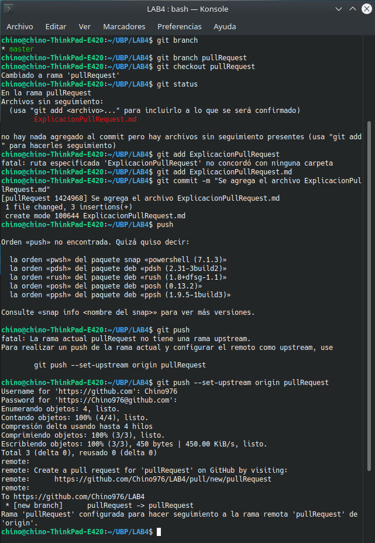
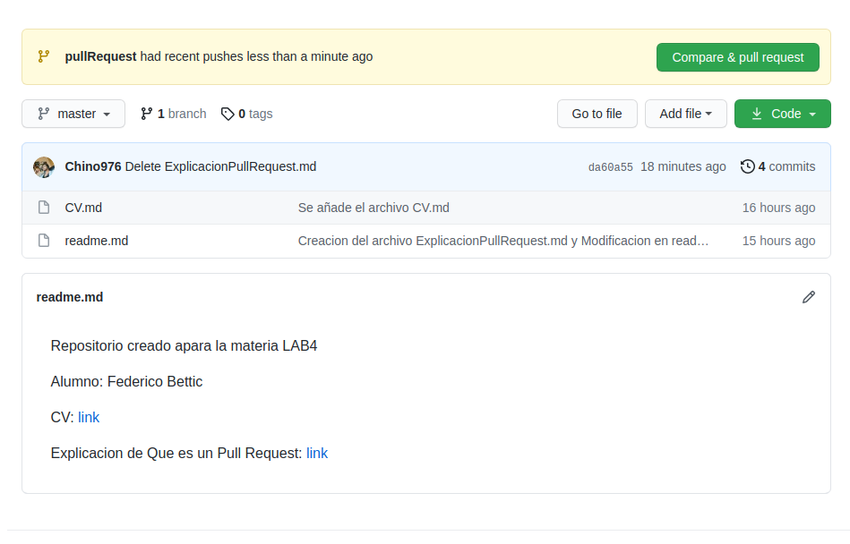
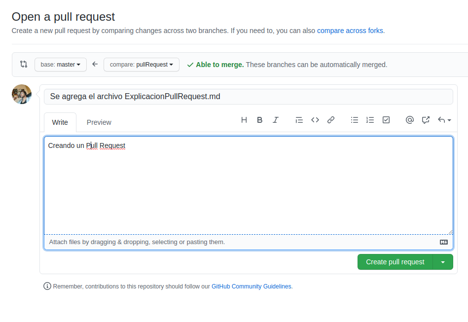
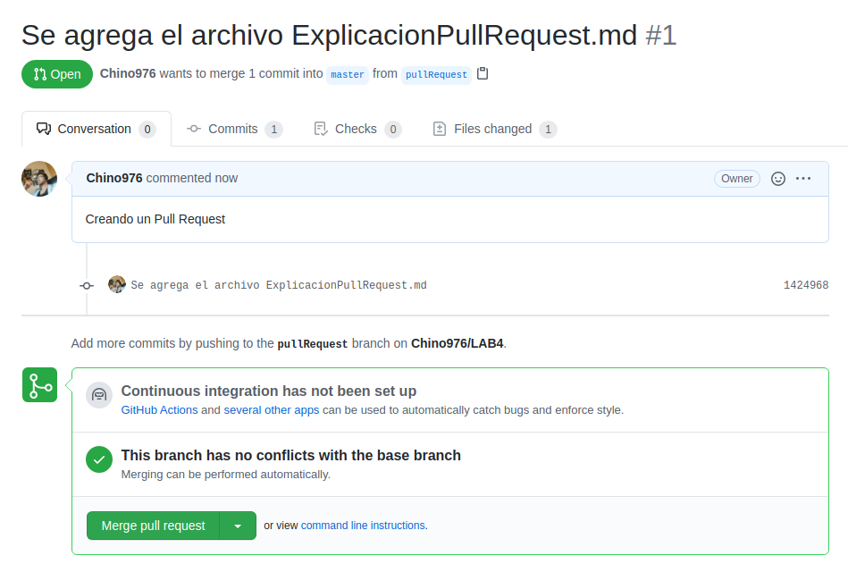
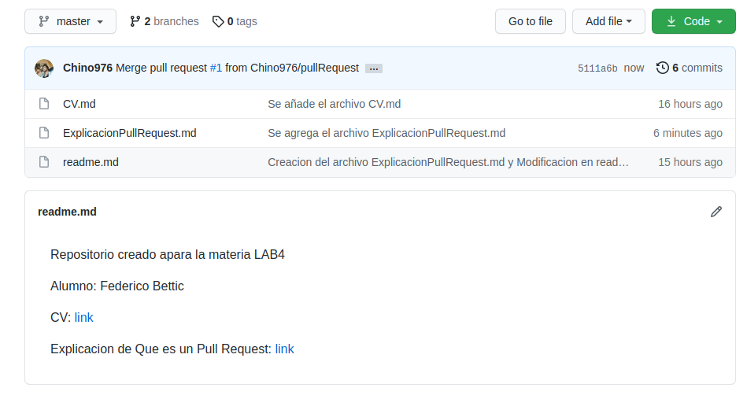
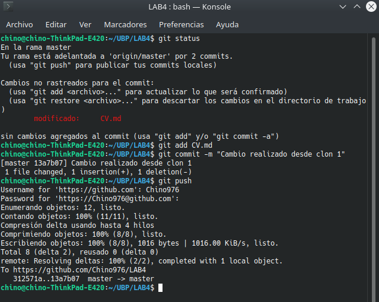
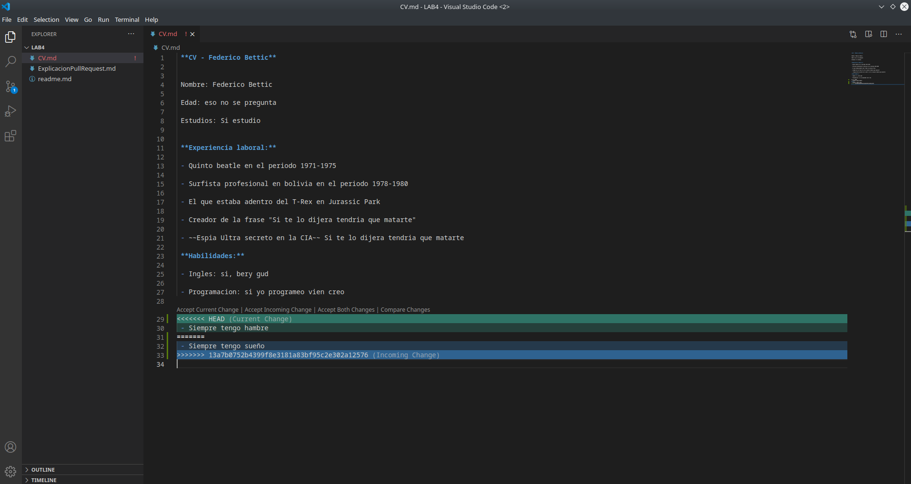
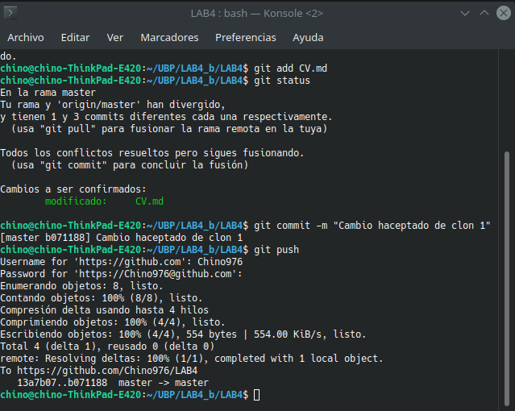
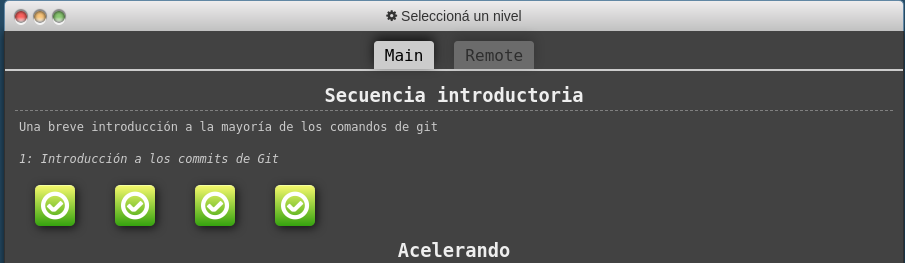

# ing-lab-4

Repositorio de trabajo practico: [link](https://github.com/Chino976/LAB4)

**Imagenes Ejercicio 4:**

--------------------------------------

**Imagenes Ejercicio 5:**

-----------------------------------------

**Imagenes Ejercicio 6:**

----------------------------------------
